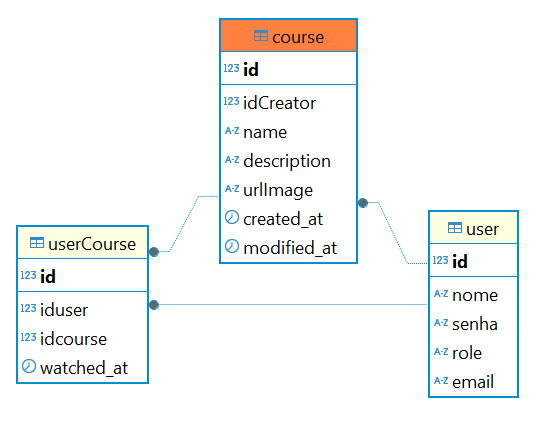

Passos iniciais:

1- Baixe o docker desktop na máquina
2- Abra o terminal na pasta raiz deste projeto e rode o comando docker-compose up -d
4- Baixe o php e configure na máquina
3- No mesmo terminal rode o comando **php -S localhost:8000**

Diagrama de Dados
